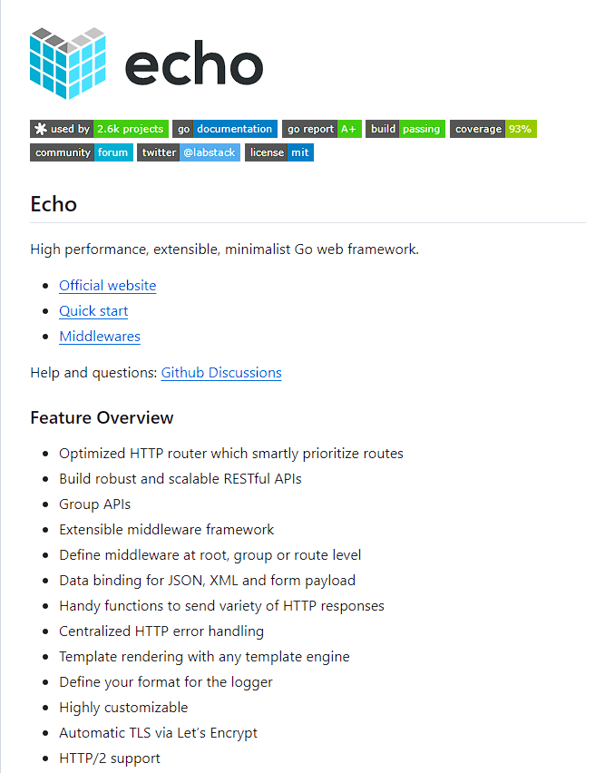

# Golang

Some project & Code for Golang learning

## Learning
### The Go Programming Language (go 语言圣经)

* [**Book link**](https://books.studygolang.com/gopl-zh)

* [**Conclusions**](https://github.com/lovelydayss/mblog/blob/master/markdown/gopl/gopl.md)

* [**Code link**](https://github.com/lovelydayss/mblog/blob/master/markdown/gopl/gopl.md)

### Advanced Go Programming

* [**Conclusions**](https://github.com/lovelydayss/mblog/blob/master/markdown/gopl/gopl.md)

* [**Code link**](https://github.com/lovelydayss/mblog/blob/master/markdown/gopl/gopl.md)

## Project Read

### echo

[**Project link: labstack/echo**](https://github.com/labstack/echo)

